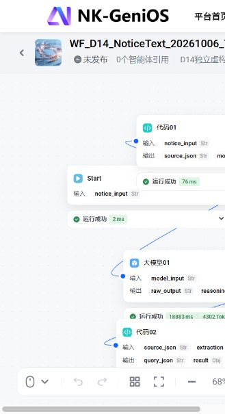

# D14 通知工作流实际验证

2026-10-06。本次范围：提取、分析、后端确认保存；前端不继续开发。采用自编虚构正文，学校测试稿未发布、未绑定主 Agent；云数据库与服务未部署。

## 学校实际 Debug

[WF_D14_NoticeText_20261006_Test](https://coze.nankai.edu.cn/product/llm/workspace/datqfnm9t58vf5r4v1eg/workflow/db29gkl4shhbpg8vbkj0/update) 是新副本，0个智能体引用。原工作流保留。

输入是此前固定夹具之外的新正文：

> 请在2026年9月21日10:10前提交虚构实验报告，预计20分钟，材料：实验PDF。
> 2026年9月21日11:00至11:30参加虚构讨论会。
> 本周五前提交虚构调研表。
> 本通知仅用于测试。

先后出现的真实问题：数组误成字符串/布尔值；引用字段误用event.start；耗时误成字符串；结构运行成功但引用遗漏5个标点。全部保留校验与缺项门禁，按实际失败补全提示词类型规则与完整原文段落输入，没有人工改模型答案后宣称成功。

第6次运行：模型doubao-seed-2-0-mini；工作流19163 ms，模型18883 ms；Start、输入代码、模型、校验代码、End均成功。输出3项行动、1项背景；96字符覆盖检查无遗漏，ok=true，can_save=false。相对日期仍为unknown，source_review与关键字段确认仍保留。这证明本输入的结构/引用通过，不证明通用通知准确率或所有语义均正确。

原始提取JSON（不包含模型内部reasoning_content）：[成功输出](D14-genios-model-success-2026-10-06.json)。真实错误样本：[类型失败](D14-genios-first-failure-2026-10-06.json)、[引用字段失败](D14-genios-span-failure-2026-10-06.json)、[耗时类型失败](D14-genios-duration-failure-2026-10-06.json)。

学校画布截图（当前侧栏较窄，完整节点结果以工作流与JSON为准）：

## 原始学校输出进入本地后端

将上述未经改写的model_output送入本次统一 `/api/v1/notice-text/workflow`，使用HTTP TestClient和实际嵌入式PostgreSQL执行独立身份/通知RPC。账号验证替换为两个受控虚构账号；不是学校Cookie直连云数据库验收。

- 提取仍为3项，原文覆盖无遗漏；未确认时不直接写库。
- 第一项明确确认截止10:10、耗时20分钟、最早09:40后，调用真实B算法得到09:40—10:00；创建草稿、确认、提交、同键重试返回同一任务。due仍为10:10，实际工作安排单独保存。
- 第二项明确确认11:00—11:30后，真实课表算法检出1处冲突。测试明确accept_conflicts=true再保存固定活动；selected_slot为null。
- 第三项只确认原文，没有补具体日期/耗时，返回clarification_required，无候选；创建草稿返回409，不能用“已阅读”绕过缺项。
- 本人列表确有2条记录，完整原文和原始模型JSON保持原样；重建HTTP应用实例后读回与重建前一致。PG测试进程保持运行，本轮没有重启数据库进程或整台机器。

实际保存与读回证据：[本地PG记录](D14-school-model-local-pg-readback-2026-10-06.json)。此记录明确cloud_deployed=false。

## 回归与边界

后端相关测试 `test_notice_workflow.py`、`test_cloud_notice_text.py`、`test_notice_pilot.py`、`test_contracts.py`：38 passed、1 skipped；跳过的是本轮未启用的系统OCR实跑，前轮已有独立OCR记录。另有1条第三方弃用警告。真实失败输出也纳入后端拒绝回归。第一次读取学校错误日志的测试解析器选错行而失败，修正后复测6项通过；不将失败运行计入成功。

工作流JavaScript输入、校验与请求拼装：12 passed。

新编排入口与步骤说明见[业务流程交接](../../handoffs/D-notice-workflow-2026-10-06.md)。后端写入门禁、PG资源版本、幂等、身份与OCR边界沿用D13。日历完成/取消/恢复/提醒状态API尚待接入；云迁移、新服务上线与学校OAuth工具正式绑定未执行。
