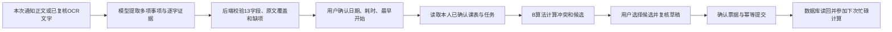

# 通知提取、分析与保存工作流

按负责人本次“先写提取、分析、写入后端，再用 GeniOS 验证”的要求实现。前端由其他人负责；日历交接中的完成、取消、恢复和提醒状态接口是下一阶段，本文不把这些接口算作已完成。

## 可核对的业务流程



每一步可检查的是输入、结构化结果、原文证据、待确认字段和真实工具输出。模型不负责心算课表空档或签署用户确认。

1. 读取：原文分为固定活动、截止任务和未分类背景；每项保留原文引用。只给日期、相对日期缺参照、取消或矛盾的通知保留澄清项。
2. 分析：模型字段须逐项复核；截止任务的 due 保持为要求时刻，用户选出的连续工作区间单独保存在 selected_slot。本人课表与已保存安排来自后端，调用者不能提供任意 owner 或课表覆盖。
3. 写入：创建/修改草稿，本人明确确认，提交并读回；每次写前重验当前资源，数据库内再校验资源版本。草稿不占时间，保存后的安排才占用。重复请求返回同一记录，冲突和旧版本拒绝。

## 统一后端编排入口

新增 `POST /api/v1/notice-text/workflow`，沿用既有本人 Cookie、同源和 CSRF 检查、新通知试点开关。它只提取和分析；保存使用原有 drafts → confirmations → commit 接口。

```json
{
  "read": {
    "source_text": "本次自编虚构通知正文",
    "source_ref": "self-authored",
    "reference_at": null,
    "fictional_data_confirmed": true,
    "model_output": "学校大模型节点的原始JSON字符串，可省略"
  },
  "analysis": null
}
```

只提取时 analysis 为 null，响应 stage=source_review；返回完整 batch、steps、saved=false 与 save_next 接口位置。

分析时 analysis 提供 item_index（本批0开始）、user_confirmations、window、available_windows，可选 buffers。后端自动使用该事项的服务器 ID；缺项返回 clarification_required，截止任务有候选返回 selection_required，无候选返回 no_available_slot，固定活动返回 confirmation_required。analysis 内有原始 TimeRequest/TimeResult、候选、冲突、覆盖和可用于草稿的 Plan。任何状态都不代表已写入。

本轮查询窗口由调用方明确提供，可运行历史虚构测试；不会自动把9月演示日期移到今天。日历前端接口拟要求从当前时间起安排，须在下一阶段日历 API 中实现，不能混同为这里已有的行为。

代码：`backend/app/core/notice_workflow.py`；HTTP：`backend/app/api/cloud_notice_text.py`；请求契约：`NoticeTextWorkflowRequest`。完整写入、身份、OCR、大小和错误边界沿用 [D接口交接](D-notice-backend-interface-2026-10-06.md)。

## GeniOS 独立试验

测试稿名 `WF_D14_NoticeText_20261006_Test`，新建副本，未发布且没有绑定智能体。入口 notice_input 是含 source_text/source_ref/reference_at/fictional_data_confirmed 的完整 JSON 字符串；参数名不是 fixture_id，代码不选固定答案。

节点：Start → `notice-school-input.js` → `prompts/notice-extract.md` → `notice-text-validate.js` → End。校验节点同时输出结构化 result 和含原始模型字符串的 query_json，后者可送本人后端 read 或统一 workflow。

GeniOS 实跑结果与后端 PG 保存测试会记录在 D14 验收文件中。学校 Debug 只证明本次模型提取/代码校验；本地 PostgreSQL 保存读回只证明本地后端，线上迁移和服务尚未部署，不能把两段证据说成学校已直接写入云数据库。
